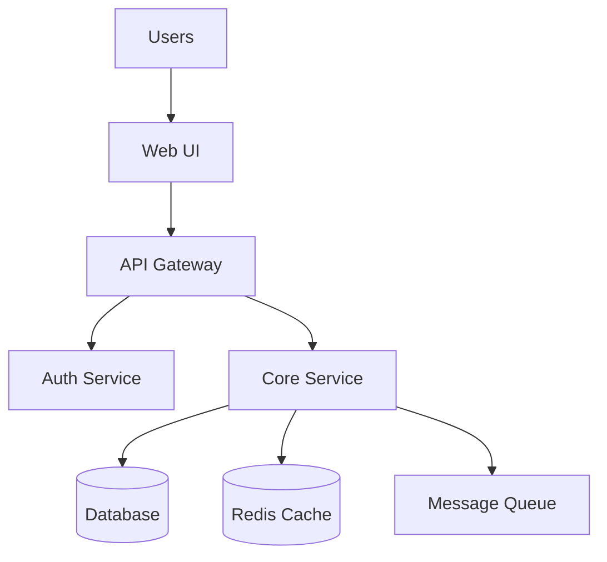
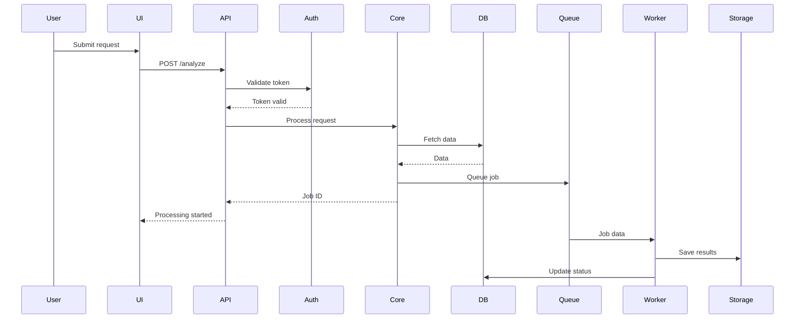
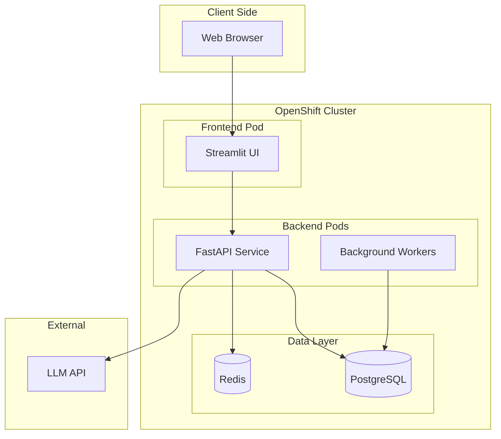

The user input to you can be provided directly by the agent or as a command argument - you **MUST** consider it before proceeding with the prompt (if not empty).

User input: $ARGUMENTS

# Sketch - Architectural Design

## Purpose

Create a lightweight architectural sketch that captures the shape of the system without premature optimization or over-engineering. This is the visual thinking step that helps you and the AI align on "what are we building and how does it fit together?"

**Think of this as:** An expert system architect facilitated a design session with you and produced something that wows you - clear, insightful, exactly what you needed to see.

**Not:** A 50-page enterprise architecture document or coffee table book of diagrams.

## Process

### Step 1: Understand Context

**Check for existing work:**

1. Look for `ideas/[project-name]/` - read to understand requirements and vision
2. Look for `sketches/[project-name]-sketch.md` - if exists, we're iterating
3. Check if we're in an existing codebase with architecture already

**If continuing an existing sketch:**
- Read the current sketch
- Summarize: "Here's what we have so far..."
- Ask: "What do you want to refine or add?"

**If starting fresh:**
- Proceed to Step 2

### Step 2: Analyze Existing Codebase (if applicable)

**If we're in an existing repository with code:**

Ask the user: **"I see existing code here. Would you like me to analyze the current architecture using repomix?"**

**If yes:**
1. Run: `npx repomix --style xml`
2. Read the generated `repomix-output.xml` or `repomix-output.txt` file in full
3. Analyze the existing architecture, components, patterns, data flows
4. Delete the repomix output file: `rm repomix-output.*`
5. Summarize findings: "Here's what I found in the existing codebase..."
6. Ask: "Are we extending this architecture, or reimagining it?"

**If no (or repomix not wanted):**
1. Read through source files to understand current structure
2. Check for common patterns (MVC, microservices, layered, etc.)
3. Look at imports/dependencies beyond just package manifests
4. Identify existing components and their relationships
5. Summarize: "I see these components and patterns..."
6. Ask: "Should we build on this, or start fresh?"

**If we're in an empty directory or new project:**
- Proceed to exploratory dialog

### Step 3: Exploratory Dialog

Have a natural dialog to understand the system shape. Let the granularity emerge based on complexity - don't force a structure.

**Key Questions (flow naturally, don't make this a questionnaire):**

**Major Components:**
- What are the main pieces of this system?
- What does each piece do?
- Which pieces are the core vs. supporting?

**Data Flows:**
- Where does data come from?
- Where does it go?
- What transformations happen along the way?
- What triggers data movement?

**State Management:**
- Where do we have state? (databases, caches, sessions)
- Where is it stateless? (APIs, functions, pipelines)
- What needs to persist? What's ephemeral?

**Integration Points:**
- What external systems do we talk to?
- What talks to us?
- Are integrations synchronous or async?
- Event-driven or request-driven?

**Deployment Boundaries:**
- What runs where? (client, server, edge, batch jobs)
- What needs to be separately deployable?
- What's a single deployable unit?
- Monolith, microservices, or hybrid?

**User Interaction:**
- Where do users interact? (web, mobile, API, CLI)
- Real-time or batch?
- Interactive or automated?

**Scale and Performance:**
- What needs to scale independently?
- What are the bottlenecks?
- What needs caching or queueing?

### Step 4: Create or Update Sketch Document

Create/update `sketches/[project-name]-sketch.md` as a **single evolving document**.

**IMPORTANT:** This is ONE file that evolves through iteration, not multiple versions.

The sketch should include (as appropriate):

#### Component Diagram

Show major components and their relationships using Mermaid:



Or text diagram if clearer:
```
┌─────────┐
│  Users  │
└────┬────┘
     │
┌────▼────────┐
│   Web UI    │
└────┬────────┘
     │
┌────▼──────────────┐
│   API Gateway     │
└─┬──────────────┬──┘
  │              │
┌─▼────────┐  ┌─▼──────────┐
│   Auth   │  │Core Service│
└──────────┘  └─┬──────────┘
               │
          ┌────▼────┐
          │Database │
          └─────────┘
```

#### Data Flow Diagram

Show how data moves through the system:



#### Deployment Architecture

Show what runs where:



#### Integration Points

Describe external systems and how we connect:

- **Active Directory**: LDAP integration for user authentication (read-only)
- **S3 Storage**: Document storage via AWS SDK (read/write)
- **LLM API**: OpenAI-compatible API for inference (request/response)
- **Monitoring**: Prometheus metrics endpoint (push)

#### State and Persistence

Where state lives and what it contains:

- **PostgreSQL Database**:
  - User profiles and preferences
  - Project data and history
  - Audit logs
  - Job status and results

- **Redis Cache**:
  - Session data (30-minute TTL)
  - API rate limiting counters
  - Frequently accessed lookup data

- **Message Queue** (if applicable):
  - Async job processing
  - Event notifications
  - Inter-service communication

#### Key Interactions

Describe critical user flows or processes:

**Document Analysis Flow:**
1. User uploads document via UI
2. API validates and stores in S3
3. Job queued for processing
4. Worker extracts text using Docling
5. Worker generates embeddings
6. Worker stores vectors in PGVector
7. User notified of completion
8. User can query document via chat interface

#### Boundaries and Responsibilities

Clarify what each component is responsible for:

- **Web UI**: User interaction, visualization, real-time updates
- **API Gateway**: Authentication, rate limiting, request routing
- **Core Service**: Business logic, data orchestration, validation
- **Workers**: Long-running tasks, batch processing, ML inference
- **Database**: Persistent storage, transactional integrity
- **Cache**: Performance optimization, session management

#### Non-Functional Considerations

Note important architectural concerns:

- **Security**: All inter-service communication over TLS, API tokens in secrets
- **Scalability**: API and workers can scale horizontally, database vertical scaling
- **Resilience**: Retry logic for external APIs, circuit breakers for LLM calls
- **Observability**: Structured logging to stdout, Prometheus metrics, OpenTelemetry traces

#### What We're NOT Building (Yet)

Explicitly call out what's deferred:

- Real-time collaborative editing (Phase 2)
- Mobile app (Future consideration)
- Advanced analytics dashboard (Phase 3)
- Multi-tenancy (Single tenant for now)

#### Open Questions

Capture uncertainties:

- Do we need a separate admin UI, or admin features in main UI?
- Should document processing be synchronous or always async?
- How long do we retain job results? (Need retention policy)
- Do we need a staging environment, or just dev + prod?

### Step 5: Iterate Until "Done"

After creating/updating the sketch:

1. **Show the user** what you've captured
2. **Ask questions:**
   - "Does this capture the architecture?"
   - "Does this match your vision?"
   - "Are we missing any major components?"
   - "Any concerns about how these pieces fit together?"
   - "Do you have any questions about this design?"

3. **Refine based on feedback** - update the single sketch file
4. **Repeat** until the user is satisfied

### Step 6: Completion Check

When the user seems satisfied, ask explicitly:

**"Does this sketch capture what we're building? If you don't have any more questions or concerns, you're ready for the next step."**

**"To keep context manageable, I recommend running `/tech-stack` in a fresh Claude Code session. It will read this sketch and help you choose the specific frameworks and technologies for each component."**

**"Would you like to continue refining this sketch, or are you ready to move to technology selection?"**

### Step 7: Wrap Up

If the user is done:

```
Great! Your architectural sketch is complete.

Saved: sketches/[project-name]-sketch.md

This sketch shows:
- [X] components with their responsibilities
- Data flows and interactions
- Deployment architecture
- Integration points

Next step:
Run `/tech-stack` in a fresh session to choose specific technologies
for each component. It will read this sketch automatically.
```

## Notes

- **One file that evolves** - Don't create versions or iterations
- **Sketch-level detail** - Clear enough to make tech decisions, not engineering drawings
- **Visual where helpful** - Use Mermaid for complex relationships, text for simple ones
- **Capture uncertainty** - "We're not sure yet if..." is valuable information
- **Let complexity emerge** - Don't force a structure, let the dialog reveal it
- **Wow-worthy quality** - Like an expert architect facilitated this session
- **Not overdone** - Stop when it's clear, don't keep polishing

## Example Quality Bar

**Good sketch for a simple internal tool:**
```
3-4 components (UI, API, Database)
1 data flow diagram
1 deployment diagram
List of integration points
Key user flows described
Half-page to 1 page of content
```

**Good sketch for a complex system:**
```
8-12 components across layers
Multiple data flow diagrams for key interactions
Deployment architecture with pods/services
Sequence diagrams for critical flows
Integration point details
State management clarified
2-3 pages of content
```

**Both should feel complete, insightful, and actionable - just the right amount of detail for the complexity at hand.**
