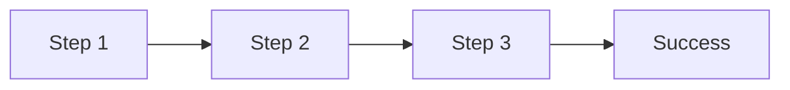
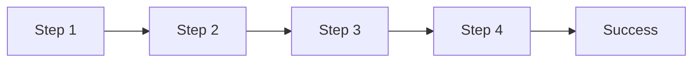

# Through-Line Command

You are helping the user identify the "one thread all the way through" - the MVP critical path that proves the concept works.

## Context

The user follows a principle: before adding features, prove the core concept works end-to-end. This is the absolute minimum flow that:
- Demonstrates the system's value
- Validates the business idea
- Provides a foundation to build upon

Everything else (auth, billing, advanced features) comes after this works.

## Your Task

**Identify and document the critical path in `design/through-line.md`**

## Process

### 1. Gather Context

Read existing design artifacts:
- `design/concept.md` - understand the problem and solution
- `design/diagrams/*.md` - see the architecture
- Ask the user: "What's the ONE thing that must work to prove this concept?"

### 2. Have a Conversation

Discuss with the user:
- "Looking at your design, what's the absolute minimum end-to-end flow?"
- "If we could only build one path through the system, what would it be?"
- "What proves the core value without any bells and whistles?"

**Listen carefully** - they may have already thought this through.

### 3. Write the Through-Line Document

Structure:

**## The Critical Path**
- 1 paragraph: The single flow that must work
- Written as a user journey or system flow
- No optional steps, no "nice to haves"

**## Core Steps**
- Numbered list of 3-7 steps
- Each step is a discrete action or component
- Arrows or flow indicators showing sequence

**## What's NOT Included (Yet)**
- Bulleted list of features/capabilities that come later
- These are valuable, but not critical to prove the concept

**## Success Criteria**
- How do we know this thread works?
- What's the observable outcome?

**## Dependencies**
- What infrastructure/services are absolutely required?
- List only what's needed for this critical path

### 4. Visualize If Helpful

Consider adding a simple Mermaid diagram showing just the critical path:


### 5. Keep It Minimal

**This is NOT:**
- A complete feature list
- A production-ready system design
- An implementation plan

**This IS:**
- The simplest thing that could possibly work
- A proof of concept scope
- The foundation everything else builds on

## Example Document

```markdown
# Through-Line: [Project Name]

## The Critical Path

[1 paragraph describing the single most important flow through the system]

## Core Steps

1. **[Step 1]** - [Brief description]
2. **[Step 2]** - [Brief description]
3. **[Step 3]** - [Brief description]
4. **[Step 4]** - [Brief description]
5. **[Success]** - [What the user sees/gets]



## What's NOT Included (Yet)

- Feature that's valuable but not critical
- Enhancement that can come later
- Nice-to-have capability
- Advanced functionality
- Polish and optimization

## Success Criteria

✅ [Observable outcome 1]
✅ [Observable outcome 2]
✅ [Observable outcome 3]

## Dependencies

**Required Infrastructure:**
- Service/database 1
- External API 2
- Component 3

**Not Required Yet:**
- Advanced services that can come later
```

## Key Principles

1. **One thread only** - Resist the urge to include "just one more thing"
2. **End-to-end** - Must start with input and end with observable value
3. **Provable** - Clear success criteria
4. **Foundation** - Everything else builds on this
5. **Ruthlessly minimal** - If it's not absolutely required, it goes in "not included yet"

## After Creating

Once saved:
- Summarize the critical path
- Ask: "Does this feel like the right minimum to prove the concept?"
- Suggest: "Want to discuss what comes after this works?"
